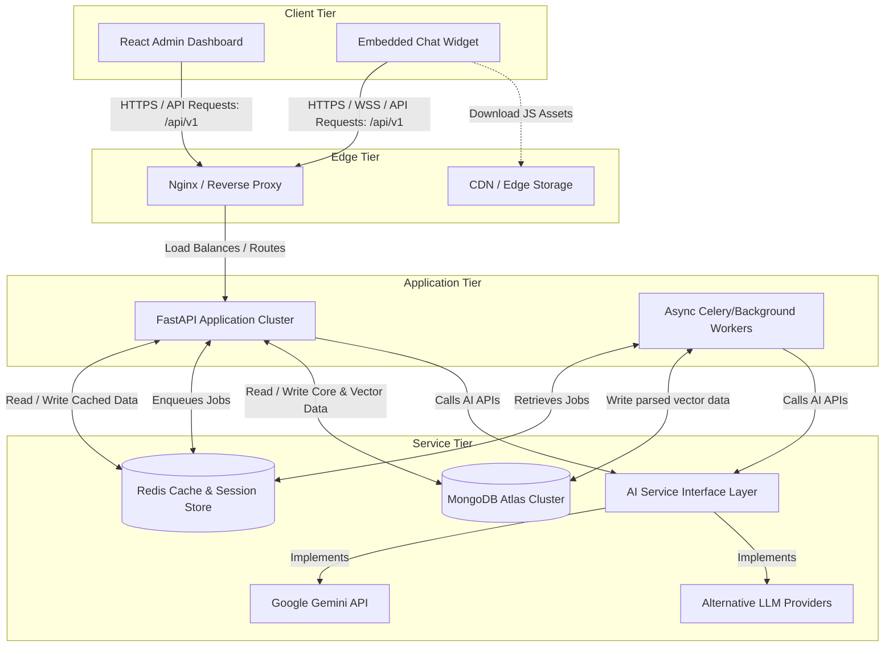
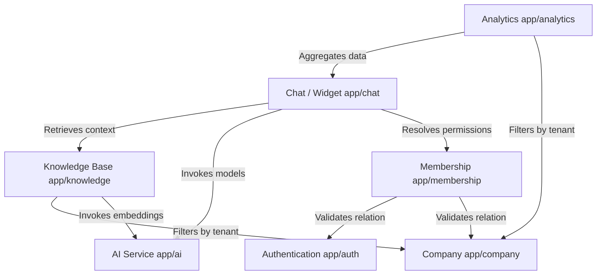
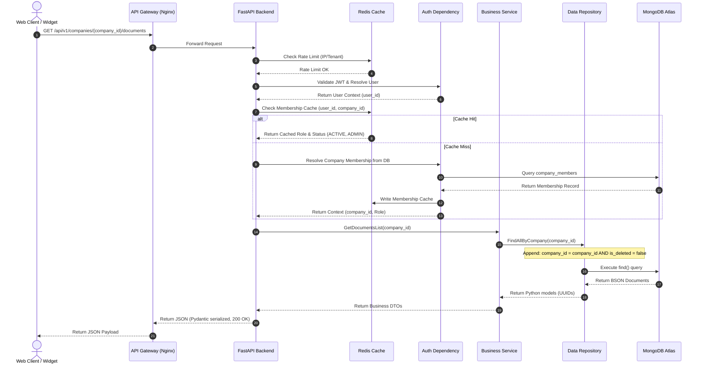
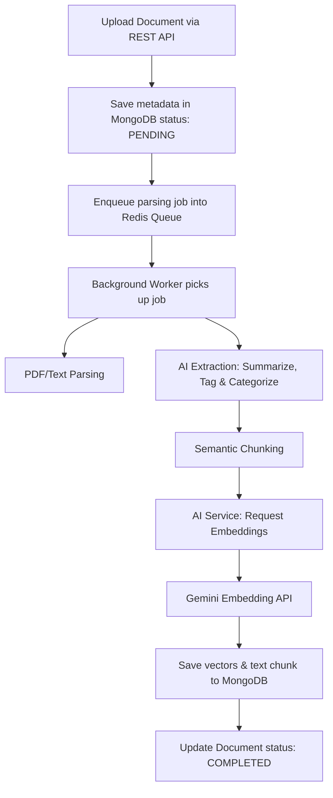
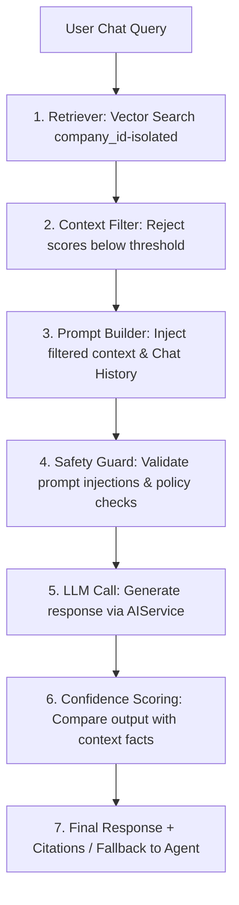

# SupportAI System Architecture (01-system-architecture.md)

## Document Metadata
*   **Status**: Frozen (Approved with modifications)
*   **Author**: Senior Backend Software Architect
*   **Version**: 1.1.0
*   **Date**: 2026-07-09

---

## 1. Purpose, Responsibilities, and Scope

### Purpose
This document establishes the high-level system architecture, component topologies, data routing, and tenant isolation strategies for the SupportAI platform. It acts as the foundational blueprint to guide all subsequent feature designs, database models, and API developments.

### Responsibilities
*   Defining system boundaries and high-level software components.
*   Enforcing a multi-tenant data isolation boundary.
*   Abstracting external service integrations (e.g., AI/LLM providers) to avoid lock-in.
*   Mapping request lifecycles and the integration flow between web clients, embedded widgets, the FastAPI backend, and upstream AI systems.
*   Outlining deployment, scaling, and architectural risk mitigations.

### Scope
Covers the core SaaS backend infrastructure, logical data separation patterns, the AI RAG ingestion and retrieval loops, authentication topology, and scalable deployment blueprints. All APIs are versioned under `/api/v1` from inception.

---

## 2. Architecture Principles
*   **Strict Multi-Tenancy**: Logical isolation of tenant data at the database query layer. No cross-tenant data leaks are permitted under any condition.
*   **Stateless Execution**: The FastAPI application tier must remain entirely stateless, enabling horizontal auto-scaling based on CPU/Memory usage.
*   **Decoupled Features**: Business features must reside in distinct modules (Feature-Based Architecture). Inter-module dependencies are injected via services, allowing clean paths for future microservice extraction.
*   **Zero MongoDB ObjectId Leakage**: All public APIs must communicate using business UUIDs. `ObjectId` remains strictly encapsulated within the database driver.
*   **Async First**: All Network I/O, database interactions, and LLM calls must use Python `async`/`await` patterns to maximize concurrency throughput.
*   **Auditability**: Every write, update, and soft delete must log audit fields (`created_at`, `updated_at`, `created_by`, `updated_by`, `deleted_at`) to maintain compliance and traceability.
*   **Provider Agnosticism**: AI capabilities must be consumed via an abstraction interface, preventing hard dependencies on a single LLM vendor (e.g., Gemini).

---

## 3. High-Level Architecture & Component Diagram

SupportAI separates administration, user facing dashboards, and widget chat APIs. 

---

## 4. Module Dependency Diagram

The modules of the system are highly decoupled, communicating with one another via services and dependency injection:

---

## 5. Multi-Tenant Isolation Strategy

SupportAI uses a **Single Database, Shared Process, Logical Isolation** model. This is cost-efficient for early-to-mid stage growth while laying the groundwork for a transition to database-per-tenant if enterprise tiers require it.

All routes targeting tenant-specific resources must be prefixed with `/api/v1/companies/{company_id}/`.

### Expanded Redis Caching Layers
To reduce database load and enforce latency budgets, Redis acts as a critical multi-layer performance engine:
1.  **Session Cache**: Stores serialized active user credentials and token blacklists mapped by `session_id`.
2.  **Tenant Cache**: Caches company profile records (branding, slug, constraints) mapped by `company_id`.
3.  **Membership Cache**: Caches user-to-company permission matrix mappings `(user_id, company_id) -> (role, status)` to bypass database lookups on every API request.
4.  **Prompt Cache**: Caches highly similar chat embeddings and corresponding responses to bypass LLM generation costs for repeat customer queries.
5.  **Rate Limiting**: Sliding window rate limits tracked by IP and Tenant API keys.

---

## 6. Request Lifecycle (Under `/api/v1/`)

The lifecycle of an API call to a protected endpoint (e.g., retrieving a company's knowledge base documents) follows this synchronous pipeline:

---

## 7. AI & RAG Pipeline

SupportAI separates processing workloads into asynchronous worker queues and synchronous querying workflows.

### A. Document Ingestion Pipeline (Asynchronous Queue/Worker Model)
To prevent network timeouts when parsing large PDFs, ingestion runs out-of-band:

1.  **Ingestion & Queueing**: A tenant uploads a file. FastAPI writes metadata status as `PENDING`, pushes the binary to object storage (e.g., S3/GCS), and queues a processing job in Redis.
2.  **Parsing & AI Metadata Extraction**: The worker downloads the document and extracts raw text. Before chunking, the worker calls the `AIService` to generate document-level metadata (a brief summary, key tags, and search categories).
3.  **Semantic Chunking**: The text is chunked dynamically. The extracted metadata is prepended/attached to each chunk to preserve overall document context.
4.  **Embedding**: Chunks are processed via the Google Gemini Embedding API (`text-embedding-004`) to generate 768-dimension vectors.
5.  **Persistence**: Vector representations are saved to the `documents` collection alongside raw text, metadata tags, and the corresponding parent document ID.

### B. User Chat Query Pipeline (Synchronous RAG)

1.  **Retriever**: Vector Search in MongoDB restricted to the tenant's `company_id`.
2.  **Context Filter**: Eliminates noise. Chunks with cosine similarity score below a designated threshold (e.g., `< 0.65`) are dropped.
3.  **Prompt Builder**: Combines system directives, previous conversation memory, context chunks, and the user query.
4.  **Safety Guard**: Inspects input/output payloads to block prompt injection attempts, PII leaks, or toxic output.
5.  **LLM Call**: Dispatched through the `AIService` layer (allowing swap-out to OpenAI, Anthropic, or local models).
6.  **Confidence Scoring**: The LLM evaluates the factual grounding of its own output compared to the context chunks. If grounding confidence is low, the response falls back to an pre-configured tenant template ("I don't have this information, linking you to a support agent...").

---

## 8. Technology Stack Justification

| Technology | Role | Justification |
| :--- | :--- | :--- |
| **FastAPI** | Web Framework | ASGI async loop enables rapid execution of concurrent requests. Native Pydantic integration ensures request/response validation is handled automatically. All endpoints versioned under `/api/v1`. |
| **Python** | Runtime | Native support for advanced AI and LLM libraries (LangGraph, LangChain, Google AI SDK). High developer velocity. |
| **MongoDB Atlas** | Database | Relational schemas limit early SaaS iterations. MongoDB's document model matches conversation histories, message models, and metadata payloads. Built-in Atlas Vector Search removes the overhead of running a separate vector database. |
| **Motor** | Async DB Driver | Async wrapper for PyMongo, aligning database calls directly with FastAPI's async event loop. |
| **Redis** | Caching & Queueing | Performs sliding-window rate limiting, stores fast-read membership mapping contexts, caches prompts, and acts as the message broker for async ingestion task workers. |
| **AIService Layer**| AI Provider Abstraction| Intermediary interface defining embedding generation and text completion contracts. Decouples the application code from vendor-specific libraries (Gemini). |

---

## 9. Deployment Architecture

SupportAI is designed to be cloud-native and deployable to major cloud platforms (AWS/GCP) using containerized environments.

*   **API / Compute**: Containerized FastAPI servers running inside Docker containers on AWS ECS (Fargate) or GCP Cloud Run. Autoscale policy triggers when aggregate CPU exceeds 60%.
*   **Database**: MongoDB Atlas Dedicated Tier (M10+) with 3-node replica sets, enabling automatic failover and scale-up storage.
*   **Cache / Store**: Redis cluster for session caching and WebSocket connection state tracking.

---

## 10. Future Scalability & Architecture Placeholders

To ensure the architecture is ready for enterprise features without major core rewrites, we reserve these system boundary hooks:
*   **Billing & Subscription Plans**: Interceptor middleware that checks active company plan status from the `companies` document. Limit counters (e.g., number of documents processed, API requests) are cached in Redis and updated in real-time.
*   **Notifications Engine**: An event-driven broker interface (e.g., RabbitMQ/AWS EventBridge) publishing messages for system alerts, emails (Sendgrid/SES), and WhatsApp webhooks.
*   **Public APIs & API Keys**: An API Key authentication gateway. Validates tenant API keys, resolves corresponding `company_id` permissions, and applies customized rate-limiting pools.
*   **Webhooks**: An event publisher dispatching outgoing HTTP POST requests to registered tenant endpoints upon events (e.g. `conversation.created`, `message.unresolved`).
*   **Marketplace Integrations**: Connectors module handling OAuth flows with platforms like Zendesk, Shopify, and Slack to pull help articles or sync chat logs.

---

## 11. Risks, Assumptions, and Trade-offs

### Risks
*   **Prompt Injection / Safety**: Customer-facing widgets are exposed to malicious prompts.
    *   *Mitigation*: Implement a strict system prompt instruction layer, guardrails, and run content moderation queries.
*   **Vector Retrieval Quality**: Irrelevant context fed to the LLM will generate poor answers.
    *   *Mitigation*: Perform semantic search filtering based on score thresholds and fallback to human agents.

### Assumptions
*   MongoDB Atlas will serve as both our primary transactional database and our vector store, reducing complex synchronization systems between separate systems.
*   FastAPI is deployed in an environment with automated environment variables injection (e.g. AWS Parameter Store / GCP Secret Manager).

### Trade-offs
*   *Shared Database vs. Separate Database per Tenant*: Shared database minimizes cost and maintenance overhead in early stages, but introduces the risk of logic bugs leaking tenant data. We mitigate this through repository-level forced filters.

---

## 12. Design Decisions (A/L/E)

### Logical Multi-Tenancy via Junction Collection (`company_members`)
*   **Advantage**: High flexibility. A single user can belong to multiple companies (e.g. support agents servicing multiple clients) with differing roles.
*   **Limitation**: Requires join queries or multi-step pipeline validations, increasing DB call overhead.
*   **Future Expansion**: Easily cache membership matrices in Redis (`user_id` -> list of `company_id` and `roles`) to bypass MongoDB lookups on API calls.

### MongoDB Atlas as Vector Database
*   **Advantage**: Single technology stack. Transactional data and vector data exist inside the same documents, removing the need for double writes, synchronizers, or dedicated vector DB pricing.
*   **Limitation**: Less specialized tuning compared to standalone vector stores like Pinecone or Qdrant for massive billion-scale vector sets.
*   **Future Expansion**: MongoDB Atlas supports dedicated search nodes. As scale demands it, search operations can be directed to search-optimized hardware without changing database code.
