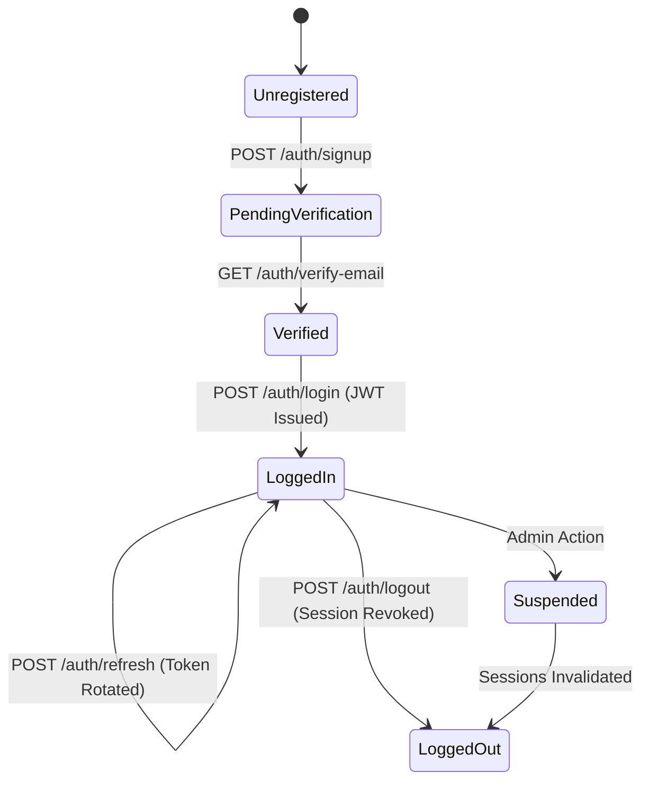
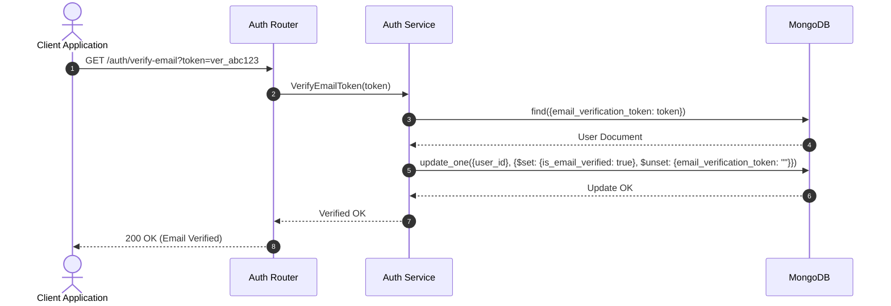

# SupportAI Authentication & Authorization Design (03-authentication-design.md)

## Document Metadata
*   **Status**: Frozen (Approved with modifications)
*   **Author**: Senior Backend Software Architect
*   **Version**: 1.1.0
*   **Date**: 2026-07-09

---

## 1. Authentication Overview

### Goals
*   **Stateless Scaling**: Maintain a stateless web tier via JWTs while supporting immediate token revocation.
*   **Decoupled Tenancy**: Establish a multi-tenant authentication framework where identities are decoupled from workspaces (companies).
*   **Replay & Hijacking Defense**: Mitigate token leakage risks via cryptographically bound refresh tokens and automatic reuse detection.
*   **Global Revocation**: Support immediate "Logout All Devices" via user-versioned token matching.

### Security Model & Trust Boundaries
The application boundary separates the untrusted network (clients/widgets) from the trusted internal backend resources.
*   **Untrusted Zone**: The client web browser or third-party websites embedding the widget. 
*   **Gateway Zone**: Reverse proxy (Nginx) terminating SSL and applying rate limiting.
*   **Secure Core Zone**: The FastAPI application, Redis cache, and MongoDB clusters. All traffic within this zone must be authenticated and filtered by tenant context.

---

## 2. User Lifecycle



*   **Registration & Verification Workflow**: 
    1. A guest signs up via `/auth/signup`. A user document is created with `is_email_verified: false` and a cryptographically signed validation token (`email_verification_token`) is generated.
    2. An email is dispatched asynchronously to the user.
    3. Clicking the link calls `/auth/verify-email`, matching the token, setting `is_email_verified: true`, clearing the token, and setting user status to active.
*   **Login**: The user provides credentials via `/auth/login`. On success, a database session document is created, and an Access/Refresh token pair is issued.
*   **Refresh**: The client submits a refresh token via `/auth/refresh` to obtain a new access/refresh pair. The old refresh token is immediately revoked.
*   **Logout**: Destroys the active database session, rendering the refresh token permanently invalid.
*   **Logout All Devices**: Updates the user's `token_version` in the database and revokes all active session records.

---

## 3. JWT Design

### Specifications
*   **Signing Algorithm**: Asymmetric `RS256` preferred. Symmetric `HS256` as fallback for local dev.
*   **Expiration**: Access tokens expire after 15 minutes. Refresh tokens expire after 30 days.

### Access Token Claims (Decoded Payload)
```json
{
  "iss": "https://api.supportai.com",
  "sub": "usr_9b1deb4d-3b7d-4bad-9bdd-2b0d7b3dcb6d",
  "sid": "ses_4a2c9b1d-8e6f-4d3a-9bdd-7b2d0c1e8f9a",
  "ver": 1,
  "exp": 1783584000,
  "nbf": 1783580400,
  "iat": 1783580400,
  "jti": "tok_2f4b9e28-1b2c-4d5e-8f9a-0b1c2d3e4f5a",
  "typ": "access"
}
```
*   `sub` (Subject): The user's business `user_id` (UUIDv4).
*   `sid` (Session ID): Connects the JWT to a specific database `session_id` to allow specific session revocation.
*   `ver` (Token Version): Must match the user's database `token_version` to support instant global revocation.

### Token Versioning & Global Revocation ("Logout All Devices")
1.  **Storage**: The `users` collection maintains a `token_version` counter (default: `1`).
2.  **Issuance**: Every access token embeds the current `token_version` as the `ver` claim.
3.  **Global Logout Trigger**: When a user selects "Logout All Devices":
    *   The system increments the user's `token_version` by 1 in the database.
    *   The system invalidates all records in the `sessions` collection matching the user's `user_id`.
4.  **Verification**: The auth middleware decodes the JWT access token and compares the `ver` claim against the database user record (cached in Redis). If the token's `ver` is less than the current database `token_version`, the token is rejected.

---

## 4. Session Management

The `sessions` collection tracks device-specific authorization contexts:

*   **Refresh Token Rotation (RTR)**: Plaintext refresh tokens are hashed (SHA-256) before database lookup. Upon refresh, the session's hash is updated to the newly rotated token.
*   **IP and Device Fingerprinting**: Stores client metadata (`ip_address`, `user_agent`). If a session refresh request originates from a radically different location or device profile, it is flagged, blocked, and requires re-authentication.

---

## 5. Password Security

*   **Preferred Hashing Algorithm**: **Argon2id** (minimum metrics: `m=65536, t=3, p=4`).
*   **Fallback Hashing Algorithm**: **Bcrypt** (cost factor: `12`), only used if environment runtime constraints block Argon2 compilation.
*   **Account Lockout Control**:
    *   `failed_login_attempts`: Integer tracking consecutive failed logins.
    *   `locked_until`: UTC DateTime indicating lock expiry (default: `null`).
    *   *Trigger*: After 5 consecutive failures, `locked_until` is set to `now + 15 minutes`. The login route rejects requests instantly if `now < locked_until`.

---

## 6. Authorization (RBAC)

Tenant access control is handled through a decoupled role-based permission model centered on the `company_members` collection.

*   **FastAPI Context Resolution**: 
    1. Access Token is decoded. The `user_id`, `sid`, and `ver` are extracted.
    2. Tenant ID is resolved from the custom request header `X-Company-ID`.
    3. The middleware resolves the membership. If valid, the context returns:
       `CurrentContext(user_id, company_id, role, membership_status)`.

---

## 7. Security Countermeasures & Audit Logs

### Important Authentication Audit Log Events
The system logs the following critical security events to the `audit_logs` collection:
*   `USER_SIGNUP`: Generated upon account creation.
*   `EMAIL_VERIFICATION_SENT`: Logged when email verification is dispatched.
*   `EMAIL_VERIFIED`: Logged when verification completes.
*   `USER_LOGIN_SUCCESS`: Logged upon successful authentication.
*   `USER_LOGIN_FAILED`: Logged upon credential mismatch.
*   `ACCOUNT_LOCKOUT`: Logged when a user account exceeds 5 failed attempts.
*   `SESSION_REVOKED`: User logs out of a single device.
*   `GLOBAL_LOGOUT`: User triggers "Logout All Devices".
*   `TOKEN_REPLAY_DETECTED`: Triggered when an expired or already rotated refresh token is presented.

---

## 8. API Contracts

### A. POST `/api/v1/auth/signup`
*   **Purpose**: Creates a new user identity (requires verification).
*   **Request Payload**:
    ```json
    {
      "email": "user@example.com",
      "password": "SecurePassword123!",
      "full_name": "John Doe"
    }
    ```
*   **Response (201 Created)**:
    ```json
    {
      "status": "success",
      "data": {
        "user_id": "9b1deb4d-3b7d-4bad-9bdd-2b0d7b3dcb6d",
        "email": "user@example.com",
        "full_name": "John Doe",
        "is_email_verified": false,
        "created_at": "2026-07-09T14:52:50Z"
      }
    }
    ```

---

### B. POST `/api/v1/auth/login`
*   **Request Payload**:
    ```json
    {
      "email": "user@example.com",
      "password": "SecurePassword123!"
    }
    ```
*   **Response (200 OK)**:
    ```json
    {
      "status": "success",
      "data": {
        "access_token": "eyJhbGciOiJIUzI1NiIsIn...",
        "refresh_token": "ref_8f7e6d5c-4b3a-2f1e-0d9c-8b7a6f5e4d3c",
        "expires_in": 900,
        "token_type": "Bearer"
      }
    }
    ```

---

### C. POST `/api/v1/auth/refresh`
*   **Request Payload**:
    ```json
    {
      "refresh_token": "ref_8f7e6d5c-4b3a-2f1e-0d9c-8b7a6f5e4d3c"
    }
    ```
*   **Response (200 OK)**:
    ```json
    {
      "status": "success",
      "data": {
        "access_token": "eyJhbGciOiJIUzI1NiIsIn...",
        "refresh_token": "ref_0a1b2c3d-4e5f-6a7b-8c9d-0e1f2a3b4c5d",
        "expires_in": 900,
        "token_type": "Bearer"
      }
    }
    ```

---

### D. POST `/api/v1/auth/logout`
*   **Request Payload**:
    ```json
    {
      "refresh_token": "ref_0a1b2c3d-4e5f-6a7b-8c9d-0e1f2a3b4c5d"
    }
    ```
*   **Response (200 OK)**:
    ```json
    {
      "status": "success",
      "message": "Session successfully revoked"
    }
    ```

---

### E. GET `/api/v1/auth/me`
*   **Headers**: `Authorization: Bearer <access_token>`, `X-Company-ID: <company_id> (Optional)`
*   **Response (200 OK)**:
    ```json
    {
      "status": "success",
      "data": {
        "user_id": "9b1deb4d-3b7d-4bad-9bdd-2b0d7b3dcb6d",
        "email": "user@example.com",
        "full_name": "John Doe",
        "is_active": true,
        "active_company": {
          "company_id": "com_8a2c9b1d-8e6f-4d3a-9bdd-7b2d0c1e8f9a",
          "role": "ADMIN",
          "status": "ACTIVE"
        },
        "created_at": "2026-07-09T14:52:50Z"
      }
    }
    ```

---

### F. GET `/api/v1/auth/verify-email`
*   **Query Parameters**: `token=<verification_token>`
*   **Response (200 OK)**:
    ```json
    {
      "status": "success",
      "message": "Email successfully verified. Account is now active."
    }
    ```
*   **Errors**: `400 Bad Request` (Invalid or expired token).

---

## 9. Sequence Diagrams

*(Refer to diagrams in 1.0.0. Added Email Verification Flow below)*

### Email Verification Flow


---

## 10. Future Expansion Placeholders

*   **OAuth (Google/Microsoft)**
*   **Passkeys & MFA**
