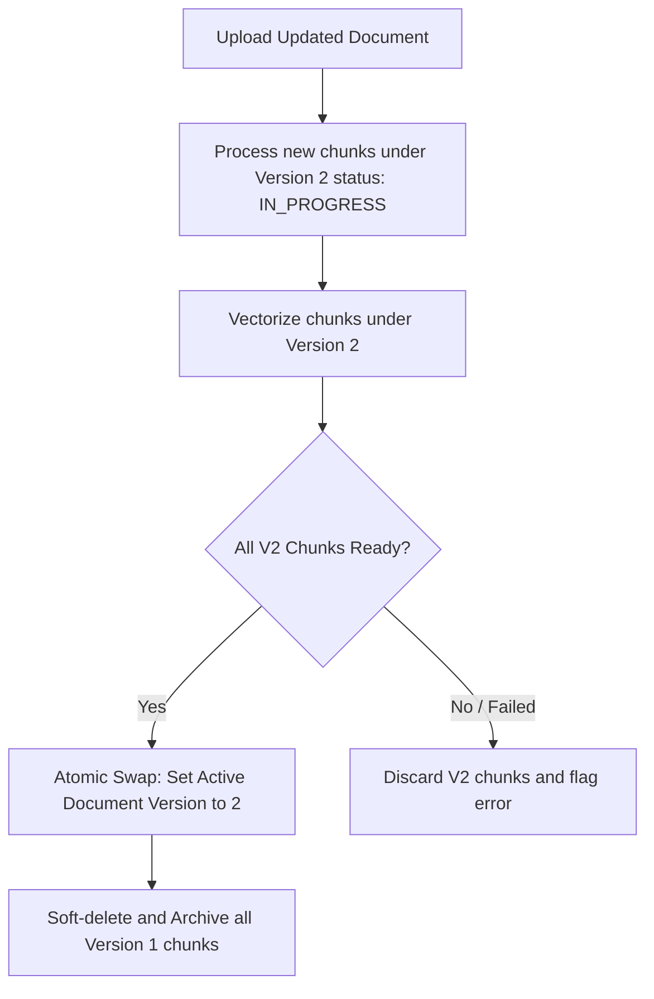
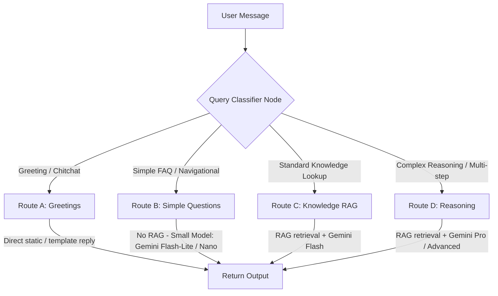
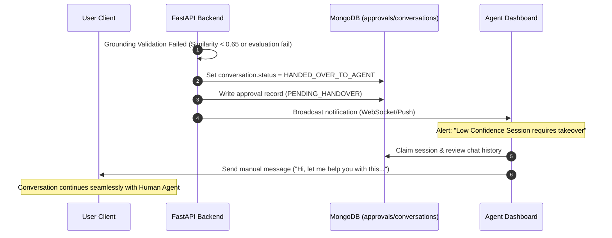

# SupportAI Knowledge Management & AI Architecture (04-knowledge-ai-design.md)

## Document Metadata
*   **Status**: Frozen (Approved with modifications)
*   **Author**: Senior Backend Software Architect
*   **Version**: 1.1.0
*   **Date**: 2026-07-09

---

## 1. Purpose, Responsibilities, and Scope

### Purpose
This document establishes the architecture for SupportAI's Knowledge base Ingestion pipeline and retrieval-augmented generation (RAG) system. It details how source documentation is securely parsed, vectorized, queried, and processed by LLMs to deliver accurate and grounded support answers.

### Responsibilities
*   Defining the asynchronous worker pipeline for document parsing, versioning, and re-embedding.
*   Enforcing metadata extraction and semantic text chunking rules.
*   Specifying MongoDB Atlas Vector Search query formats, indices, and cosine similarity rules.
*   Detailing security guardrails, cost-optimization routing, and factual grounding validation (confidence scoring).
*   Documenting the transition plan to a LangGraph-driven agent workflow.

### Scope
Covers the core ingestion engine, document chunk schemas, search algorithms, AI prompt construction, safety interceptors, and chat memory tracking. Coding implementation details are excluded.

---

## 2. Ingestion Pipeline & Background Workflows

To maintain system responsiveness, document processing runs completely asynchronously outside the web request cycle.

### Granular Chunk Metadata Schema
For optimal filtering and traceability, each chunk inside the `documents` collection is written with:
*   `document_id`: UUID (Unique chunk identifier)
*   `parent_document_id`: UUID (Groups chunks of the same source file)
*   `chunk_order`: Integer (Index of the chunk in the document, starting at `0`)
*   `page_number`: Integer (Where the text was located in the source PDF)
*   `section`: String (Header context, e.g. `## Section 3.2`)
*   `language`: String (ISO 639-1 language code, e.g. `en`)
*   `version`: Integer (Increments per document update, e.g. `2`)
*   `embedding_model`: String (The model identifier used to encode the vector, e.g. `text-embedding-004`)

---

## 3. Document Versioning & Vector Rebuilding Strategy



### Document Versioning (Updates)
1.  **Version Track**: The parent document document stores a `current_version` field.
2.  **Staging Uploads**: When a document is updated, the system processes and vectorizes the new file content under `current_version + 1`. These chunks are written to MongoDB with a status of `IN_PROGRESS`.
3.  **Atomic Promotion**: Only when all new chunks have successfully generated embeddings does the parent document atomically update its `current_version` field. The query pipeline only retrieves chunks matching the parent's `current_version`.
4.  **Cleanup**: A background task soft-deletes the older version's chunks (`is_deleted: true`).

### Vector Rebuilding (Embedding Model Upgrades)
If the platform migrates to a newer embedding model:
1.  A background rebuilding job initiates.
2.  The job iterates over active documents in batches, calling the new embedding provider, generating new vectors, and storing them in a parallel collection/schema version path.
3.  Once migration is 100% complete, the search routing configuration switches to target the new vector index, and the old vector collection is archived.

---

## 4. AI Cost Optimization Routing

To minimize LLM token costs and latency, the system intercepts queries at the Gateway/Router level and applies routing logic:



*   **Route A (Greetings)**: If the query is detected as simple chitchat (e.g. "hello", "thank you"), the system returns a template response without running vector searches or invoking heavy generative models.
*   **Route B (Simple FAQ)**: Short, non-context-heavy queries use a smaller model (e.g. `gemini-2.0-flash-lite` or local `gemini-nano`) to save costs.
*   **Route C (Standard RAG)**: Standard queries run vector lookups and call `gemini-1.5-flash` with the context.
*   **Route D (Complex Reasoning)**: Queries requesting tabular comparison, code, or debugging analysis are routed to `gemini-1.5-pro` with dynamic retrieval parameters.

---

## 5. Query Retrieval & Context Optimization

### Provider Separation Interface
To keep AI vendors interchangeable, the platform decouples components using interfaces:
*   `EmbeddingProviderInterface`: Declares `async generate_embeddings(texts: list[str]) -> list[list[float]]`.
*   `LLMProviderInterface`: Declares `async generate_completion(prompt: PromptObject, settings: AISettings) -> CompletionResponse`.

---

## 6. Prompt Construction & Extended Memory

The `PromptBuilder` merges retrieval context with a three-layer conversation memory framework:

```
[System Core Directives]
You are SupportAI, an assistant for [Company Name]. Answer using only the facts below.

[User Preferences Context]
- Language Preference: Spanish
- User Tier: Enterprise VIP

[Global Conversation Summary]
- User has asked for instructions to configure SPF records, but encountered an invalid key error.

[Recent Conversation History (N=6)]
- User: "I got error code 403 on step 4."
- Assistant: "Did you use the private key?"

[Context Facts]
- Fact 1 (Source: Setup Guide): ...
```

1.  **Recent Messages**: The last 6 messages (`N=6`) are kept in raw chronological format.
2.  **Conversation Summary**: Older messages are compressed into a running summary string written by a background worker (e.g. "User requested SPF instructions and received a 403 key error").
3.  **User Preferences**: Dynamic contextual details parsed from authentication metadata (e.g. preferred language, account status, user VIP tier).

---

## 7. Grounding Validation & Human Handover Flow

If an AI response fails validation or grounding checks, the system initiates a structured handover to human agents:



---

## 8. AI Performance Analytics Events

Every execution path logs telemetry data to the `analytics` collection to monitor costs, quality, and latency:

```json
{
  "event_id": "UUID",
  "company_id": "UUID",
  "conversation_id": "UUID",
  "metrics": {
    "latency_ms": 1150,
    "confidence_score": 0.88,
    "token_usage": {
      "prompt_tokens": 1250,
      "completion_tokens": 310,
      "total_tokens": 1560
    },
    "estimated_cost_usd": 0.000124,
    "retrieved_sources": [
      {
        "document_id": "UUID",
        "score": 0.79
      }
    ],
    "fallback_triggered": false,
    "fallback_reason": null
  },
  "created_at": "DateTime"
}
```
*   `fallback_reason` values: `LOW_VECTOR_SIMILARITY`, `HALLUCINATION_DETECTED`, `SAFETY_VIOLATION`, `PROMPT_INJECTION_DETECTED`.

---

## 9. Design Decisions (A/L/E)

### Decoupled AI Interfaces
*   **Advantage**: High maintainability. We can swap between Gemini, OpenAI, Anthropic, or an internal self-hosted LLaMA model by changing a single implementation class in config, without editing routers, repositories, or services.
*   **Limitation**: Prompt formatting must remain standardized. Advanced model-specific parameters (e.g., Gemini-specific JSON schemas) must be abstracted or normalized inside the provider class.
*   **Future Expansion**: Implement multi-provider fallback. If the Gemini API experiences an outage, the `AIService` automatically falls back to an OpenAI backup instance.
