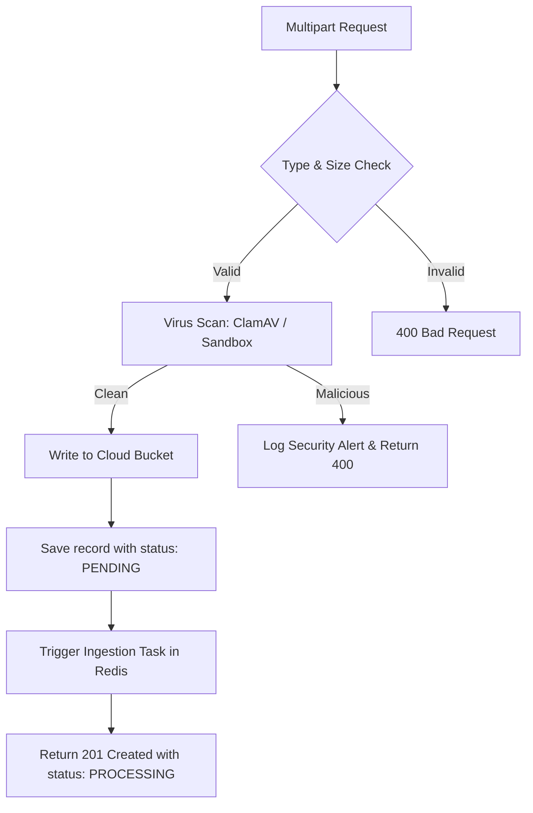

# SupportAI API Design Standards (05-api-standards.md)

## Document Metadata
*   **Status**: Frozen (Approved with modifications)
*   **Author**: Senior Backend Software Architect
*   **Version**: 1.1.0
*   **Date**: 2026-07-09

---

## 1. Purpose, Responsibilities, and Scope

### Purpose
This document establishes the official REST and WebSocket API design standards for the SupportAI platform. It ensures consistency, security, and predictability across all endpoints developed for dashboards, embedded widgets, and external integrations.

### Responsibilities
*   Defining HTTP response structures (wrappers, paginated responses, and error envelopes).
*   Enforcing standard request validation, file upload validation, and exception-handling rules.
*   Documenting middleware patterns for rate limiting, logging, distributed tracing, and idempotency.

### Scope
Applies to all HTTP RESTful routes and WebSocket connections under the `/api/v1` namespace. This document guides the development of FastAPI schemas, routers, exception handlers, and API documentation decorators.

---

## 2. API Lifecycle & Version Deprecation Policy

### API Lifecycle Stages
Every endpoint must belong to one of these defined lifecycle stages:
1.  **Draft**: Experimental API under design. Subject to breaking changes without notice. Not exposed in production.
2.  **Internal**: Private API utilized only for backend microservice/worker communications.
3.  **Beta**: Publicly accessible API for testing. Breaking changes are minimized but allowed with 14-day notice.
4.  **Stable**: Production-ready, public API. Backwards compatibility is strictly guaranteed.
5.  **Deprecated**: Active API scheduled for decommissioning.

### Version Deprecation & Sunset Policy
When an API version is deprecated, responses must include the following standard HTTP headers:
*   `Deprecation: @<timestamp>` (Signals the API is deprecated, e.g. `Deprecation: @1783584000`)
*   `Sunset: <date>` (Indicates the exact date the endpoint will be turned off, e.g. `Sunset: Wed, 11 Nov 2026 23:59:59 GMT`)
*   `Warning: 299 - "API version is deprecated and will be removed."`

---

## 3. Request Standards & Distributed Tracing

### Correlation ID Standards
To enable distributed tracing across our API Gateways, FastAPI backend, Celery Workers, Redis, and MongoDB queries:
1.  **Header Intake**: All incoming requests should look for a `X-Correlation-ID` header. If missing, the API Gateway or FastAPI middleware generates a new UUIDv4 string.
2.  **Propagation**: 
    *   This ID is set in the FastAPI application request context.
    *   When queueing background tasks in Redis, the Correlation ID is injected into the job metadata.
    *   When invoking the `AIService` (Gemini), the Correlation ID is passed in the metadata.
3.  **Logging**: The Correlation ID is automatically injected into all structured JSON logs, enabling easy end-to-end tracing in aggregated log viewers (e.g. AWS CloudWatch, Datadog).

---

## 4. Response Wrapping & Pagination Standards

### Offset Pagination Envelope
Used for low-volume administrative lists (e.g. list of company members):
```json
{
  "status": "success",
  "data": [ ... ],
  "meta": {
    "page": 1,
    "limit": 20,
    "total_items": 145,
    "total_pages": 8
  }
}
```

### Cursor Pagination Envelope
For high-volume, real-time datasets (e.g. `messages`, `conversations`, `analytics` event streams) to prevent performance degradation on large offsets:
```json
{
  "status": "success",
  "data": [ ... ],
  "meta": {
    "limit": 20,
    "next_cursor": "eyJjcmVhdGVkX2F0IjogMTc4MzU4MDQwMCwgImlkIjogIm1zZ18xMjMifQ==",
    "has_more": true
  }
}
```
*   **Parameters**: Uses `limit` (max 100) and `cursor` (a base64 URL-encoded JSON string containing sorting values like `created_at` and `message_id`).

---

## 5. Standard HTTP Status Code Reference

| Code | Status | Usage in SupportAI |
| :--- | :--- | :--- |
| **200** | OK | Successful `GET`, `PUT`, `PATCH`, or `DELETE` requests. |
| **201** | Created | Successful `POST` resulting in entity creation (e.g., signup, doc upload). |
| **304** | Not Modified | Entity is unchanged based on ETag checks (no response body sent). |
| **400** | Bad Request | Validation errors, invalid parameters, or payload anomalies. |
| **401** | Unauthorized | Missing, expired, or invalid JWT access tokens. |
| **403** | Forbidden | Valid JWT, but user lacks tenant membership role requirements. |
| **404** | Not Found | Resource UUID does not exist. |
| **409** | Conflict | Duplicate resource key (e.g., signup email) or Idempotency violation. |
| **429** | Too Many Requests | Rate limit threshold exceeded. |
| **500** | Internal Server Error | Unhandled server exceptions or DB connection timeouts. |

---

## 6. Cache Control & Conditional Requests

To conserve database read capacity, GET operations on static configurations (e.g. `widget_settings` or `ai_settings`) support HTTP ETags:
1.  **Response Generation**: The server hashes the response payload (MD5 or SHA-1) and includes the hash in the HTTP header:
    `ETag: W/"33a64df551425fcc55e4d42a148795d9f25f89d4"`
2.  **Conditional GET Requests**: Subsequent client requests send the ETag in the `If-None-Match` header.
3.  **Server Evaluation**: The API layer hashes the target record. If hashes match, the server returns an empty body with HTTP **`304 Not Modified`**, bypassing serialization and network transit costs.

---

## 7. WebSocket APIs

WebSockets are utilized for hot-path interactive events:
*   **Chat Widget**: Real-time customer conversations.
*   **Notification Dispatcher**: Broadcasts critical platform status updates.
*   **Admin Console**: Real-time monitoring of active support volumes.

### WebSocket Connection & Auth
*   **Handshake URL**: `wss://api.supportai.com/api/v1/ws`
*   **Auth Token**: WebSockets cannot pass custom headers during browser handshakes. Authentication tokens must be supplied in query parameters:
    `wss://api.supportai.com/api/v1/ws?token=eyJhbGci...&company_id=com_123`

### Message Envelope Contract
All WebSocket payloads must wrap in a standardized JSON framing contract:
```json
{
  "event": "message.sent",
  "payload": {
    "conversation_id": "conv_9b1deb4d-3b7d-4bad-9bdd-2b0d7b3dcb6d",
    "content": "Hi, I need assistance."
  },
  "correlation_id": "req_8a2c9b1d-8e6f-4d3a-9bdd-7b2d0c1e8f9a"
}
```

---

## 8. File Upload Standards

Endpoints handling binary files (e.g., PDF, TXT knowledge documents) must adhere to these policies:



1.  **Transport Protocol**: File uploads must use `multipart/form-data`.
2.  **Validation Constraints**:
    *   *Size limit*: Max 10MB per file.
    *   *Mime-Type Whitelist*: Strictly restrict to `application/pdf`, `text/plain`, `text/markdown`.
3.  **Virus Scanning**: Uploaded files pass through a streaming scanner (e.g., ClamAV daemon) in the backend before persisting to S3/GCS.
4.  **Asynchronous processing**: The API immediately writes a record status `PENDING`, pushes the clean binary to the private cloud bucket, queues the background job, and returns `201 Created` with a progress tracking URL (e.g., `/api/v1/companies/{company_id}/documents/{document_id}/status`).
