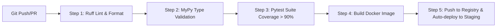

# SupportAI Project Development Roadmap (06-development-roadmap.md)

## Document Metadata
*   **Status**: Draft for Review
*   **Author**: Senior Backend Software Architect
*   **Version**: 1.0.0
*   **Date**: 2026-07-09

---

## 1. Purpose, Responsibilities, and Scope

### Purpose
This document defines the implementation roadmap, sprint plans, testing strategies, and deployment milestones for the SupportAI platform. It maps out a predictable, sequential path to build the platform from bootstrapping to production.

### Responsibilities
*   Defining sprint-by-sprint deliverables, dependencies, and file structures.
*   Enforcing testing quality gates (coverage levels, test types).
*   Establishing the platform's Definition of Done (DoD) for each sprint.
*   Outlining the CI/CD pipeline and deployment milestones.

### Scope
Covers the entire engineering execution plan for the Version 1 backend. Frontend milestones or product marketing launches are out of scope.

---

## 2. Development Order & Module Dependencies

To prevent regression loops, development is strictly sequential. A module cannot begin until all of its dependencies are frozen.

```
[Core Infrastructure] ──> [Authentication] ──> [Company Management] ──> [Membership & RBAC]
                                                                                │
                                                                                ▼
[Analytics] <── [Widget] <── [Chat Engine] <── [AI Services] <── [Knowledge Management]
```

---

## 3. Sprint-by-Sprint Plan

### Sprint 1: Core Infrastructure
*   **Objective**: Setup base project structure, database client connection pooling, standard wrappers, logging, and error-handling middleware.
*   **Files**:
    *   `app/main.py`
    *   `app/core/config.py`, `app/core/database.py`, `app/core/exceptions.py`
    *   `app/shared/base_model.py`, `app/shared/response.py`, `app/shared/utils.py`
*   **Dependencies**: None.
*   **Testing**: Unit tests validating database connection lifecycles, configuration parsing, and error wrapper responses.
*   **Deliverables**: A running, healthy FastAPI skeleton connected to a local/staging MongoDB instance with automatic OpenAPI docs.

---

### Sprint 2: Authentication
*   **Objective**: User registration, email verification, Argon2id credentials hashing, user session caching, and token creation.
*   **Files**:
    *   `app/auth/model.py`, `app/auth/schema.py`, `app/auth/repository.py`, `app/auth/service.py`, `app/auth/router.py`
*   **Dependencies**: Sprint 1 (Core).
*   **Testing**: Pytest validation of signup routes, password hashing rules, login session creation, token rotation, and global logouts via `token_version` checks.
*   **Deliverables**: Complete `/api/v1/auth` endpoints with rate limiting and secure session tracking.

---

### Sprint 3: Company Management
*   **Objective**: Create and configure tenant workspaces.
*   **Files**:
    *   `app/company/model.py`, `app/company/schema.py`, `app/company/repository.py`, `app/company/service.py`, `app/company/router.py`
*   **Dependencies**: Sprint 2 (Auth).
*   **Testing**: Validation of slug uniqueness rules, company creation validation, soft deletes, and active status state changes.
*   **Deliverables**: CRUD endpoints under `/api/v1/companies` secured by JWT authentication.

---

### Sprint 4: Membership & RBAC
*   **Objective**: Link users to companies and enforce role-based access controls via dependency injection.
*   **Files**:
    *   `app/membership/model.py`, `app/membership/schema.py`, `app/membership/repository.py`, `app/membership/service.py`, `app/membership/router.py`
*   **Dependencies**: Sprint 3 (Company).
*   **Testing**: Route interception tests (verifying VIEWERs cannot edit settings, MEMBERs cannot delete, and unauthorized users are blocked).
*   **Deliverables**: Decoupled tenant RBAC middleware and membership invitation endpoints.

---

### Sprint 5: Knowledge Management
*   **Objective**: Parse uploaded documents, generate chunk models, and configure search indices.
*   **Files**:
    *   `app/knowledge/model.py`, `app/knowledge/schema.py`, `app/knowledge/repository.py`, `app/knowledge/service.py`, `app/knowledge/router.py`
*   **Dependencies**: Sprint 4 (Membership).
*   **Testing**: Test file validators (size, mime-types), text splitters (chunk indexes, order), and parent document version increments.
*   **Deliverables**: Multipart document upload endpoints and text processing repository layers.

---

### Sprint 6: AI Services
*   **Objective**: Integrate embedding models, context thresholding, LLM APIs, and validation checks.
*   **Files**:
    *   `app/ai/service.py`, `app/ai/interfaces.py`, `app/ai/providers/gemini.py`
*   **Dependencies**: Sprint 5 (Knowledge).
*   **Testing**: Mocks verifying the replacement of LLM providers, embedding distance score evaluations, and prompt injection filters.
*   **Deliverables**: Unified AI/Embedding provider layers and factual grounding validation engines.

---

### Sprint 7: Chat Engine
*   **Objective**: Implement user conversations, message history stores, product metadata retrieval, and citation formatting.
*   **Files**:
    *   `app/chat/model.py`, `app/chat/schema.py`, `app/chat/repository.py`, `app/chat/service.py`, `app/chat/router.py`
*   **Dependencies**: Sprint 6 (AI).
*   **Testing**: Integration tests validating the context assembly flow, RAG grounding, and conversation summaries.
*   **Deliverables**: REST APIs for dialogue and WebSocket handlers for real-time streaming answers.

---

### Sprint 8: Widget Integration
*   **Objective**: Expose the embedded public widget endpoints, including branding resolution and domain whitelist/CORS configurations.
*   **Files**:
    *   `app/widget/model.py`, `app/widget/schema.py`, `app/widget/repository.py`, `app/widget/service.py`, `app/widget/router.py`
*   **Dependencies**: Sprint 7 (Chat).
*   **Testing**: Domain header validation (CORS origin validation), widget settings retrieval, and ETag cache validations.
*   **Deliverables**: Whitelisted public widget configuration and anonymous chat gateway endpoints.

---

### Sprint 9: Analytics
*   **Objective**: Track conversation metrics, token costs, latency, and unresolved query fallbacks.
*   **Files**:
    *   `app/analytics/model.py`, `app/analytics/schema.py`, `app/analytics/repository.py`, `app/analytics/service.py`, `app/analytics/router.py`
*   **Dependencies**: Sprint 8 (Widget).
*   **Testing**: Validation of cursor-paginated analytics streams and database aggregation calculations.
*   **Deliverables**: System-wide performance telemetry collection and admin analytics dashboard endpoints.

---

### Sprint 10: Cloud Deployment
*   **Objective**: Deploy the platform to containerized cloud staging environments.
*   **Files**:
    *   `Dockerfile`, `docker-compose.yml`
    *   `infra/ecs-task.json` or `infra/cloudrun.yaml`
*   **Dependencies**: Sprint 9 (Analytics).
*   **Testing**: Performance load testing (Apache Bench / Locust) to verify autoscaling boundaries and database connection pool behavior.
*   **Deliverables**: Fully operational, containerized production environment deployed on AWS/GCP with automated DNS mapping and logging.

---

## 4. Definition of Done (DoD) per Sprint

A sprint is not complete until every task meets these strict quality requirements:

1.  **Code Quality**: Zero compilation or execution warnings. Code formatted via Black/Ruff.
2.  **Type Safety**: Strict type annotations on all functions. `mypy --strict` passes with no errors.
3.  **Test Coverage**: Unit and integration test suites run automatically. Code coverage must exceed **90%** globally and **100%** on core security/auth files.
4.  **Database Guidelines**: All database reads/writes must use repository layers, enforce soft-delete flags, and log audit fields (`created_at`, `updated_at`, etc.).
5.  **Documentation**: All new routes must be fully decorated with OpenAPI schemas, descriptions, and error response examples.
6.  **Security Review**: Zero hardcoded credentials or API keys. Access credentials must resolve from environment variables via Pydantic Settings.

---

## 5. CI/CD Pipeline Milestones



*   **Milestone 1**: Code Quality Gate (enforced on pull requests).
*   **Milestone 2**: Automated Testing Suite (runs on merge to `main`).
*   **Milestone 3**: Containerized Deployment (deploys staging automatically, prompts manual approval for production).
